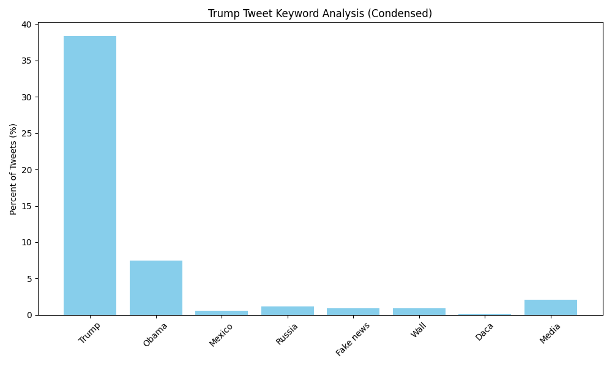

# trump_tweets_lab
## Tweet Keyword Analysis
This table and bar charts show the frequency of key words in Donald Trump's tweets from 2009–2018.

| phrase            | percent of tweets |
| ----------------- | ---------------- |
|              daca |  0.17 |
|         fake news |  0.92 |
|             media |  2.06 |
|            mexico |  0.55 |
|             obama |  7.47 |
|            russia |  1.13 |
|             trump | 38.35 |
|              wall |  0.91 |
## Keyword Frequency Plot

